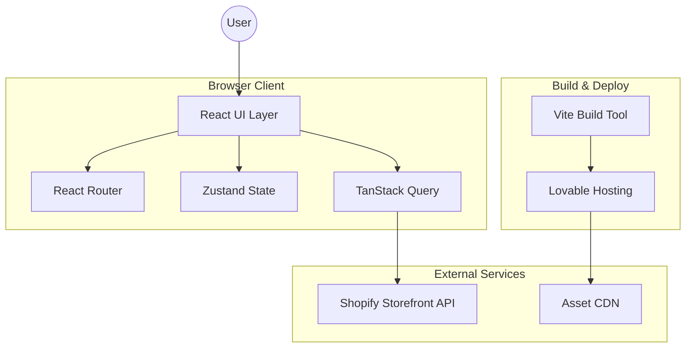
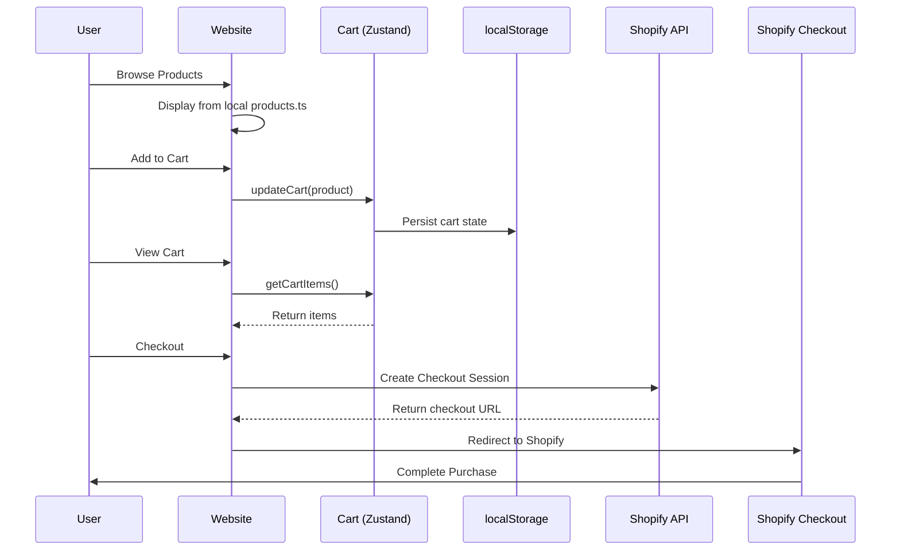
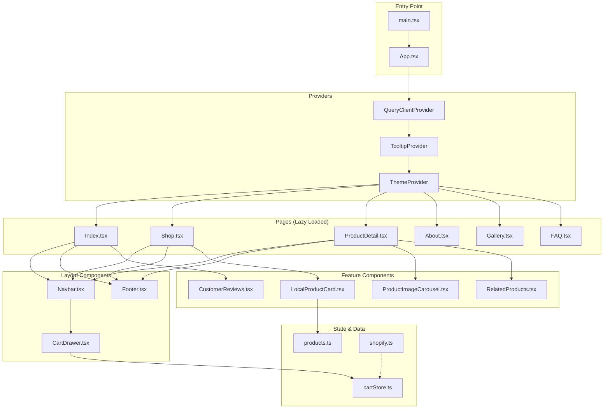
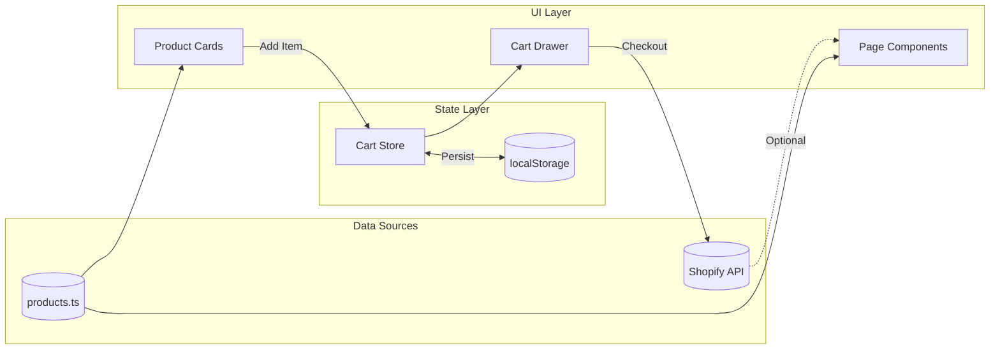
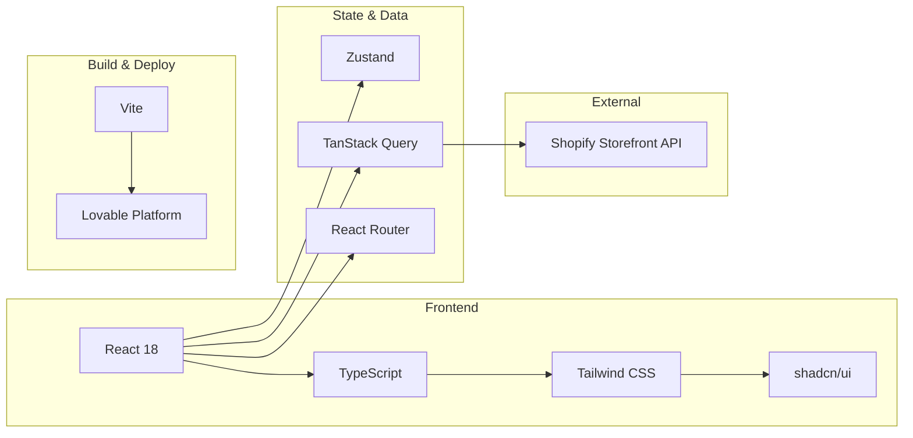

# Bulbul Website Architecture

## Overview

This document provides a comprehensive architectural overview of the Bulbul website, including system components, data flow, and Shopify integration.

## Table of Contents

1. [Overall Application Architecture](#overall-application-architecture)
2. [Shopify Integration](#shopify-integration)
3. [Component Architecture](#component-architecture)
4. [Data Flow](#data-flow)
5. [Technology Stack](#technology-stack)

---

## Overall Application Architecture



### Key Components

| Component | Technology | Purpose |
|-----------|------------|---------|
| UI Layer | React 18 + TypeScript | Component-based user interface |
| Routing | React Router v6 | Client-side page navigation |
| State Management | Zustand | Cart and application state |
| Data Fetching | TanStack Query | API calls and caching |
| Styling | Tailwind CSS + shadcn/ui | Design system and components |
| Build | Vite | Fast development and optimized builds |

---

## Shopify Integration



### Integration Points

| Feature | Current State | Description |
|---------|---------------|-------------|
| Product Display | Local Data | Products served from `src/data/products.ts` |
| Cart Management | Client-side | Zustand store with localStorage persistence |
| Checkout | Placeholder | Ready for Shopify checkout integration |
| Storefront API | Configured | Client configured in `src/lib/shopify.ts` |

### Shopify Configuration

```typescript
// src/lib/shopify.ts
const shopifyConfig = {
  domain: 'your-store.myshopify.com',
  storefrontAccessToken: 'your-token',
  apiVersion: '2024-01'
};
```

---

## Component Architecture



### Component Categories

| Category | Components | Responsibility |
|----------|------------|----------------|
| Pages | Index, Shop, ProductDetail, About, Gallery, FAQ | Route-level views |
| Layout | Navbar, Footer, CartDrawer | Persistent UI structure |
| Feature | ProductCard, Reviews, Carousel | Reusable feature modules |
| UI | shadcn/ui components | Design system primitives |

---

## Data Flow



### State Management

```typescript
// Cart Store (Zustand)
interface CartState {
  items: CartItem[];
  addItem: (product: Product) => void;
  removeItem: (productId: string) => void;
  updateQuantity: (productId: string, quantity: number) => void;
  clearCart: () => void;
  getTotalItems: () => number;
  getTotalPrice: () => number;
}
```

---

## Technology Stack



### Stack Summary

| Layer | Technologies |
|-------|--------------|
| **UI Framework** | React 18, TypeScript |
| **Styling** | Tailwind CSS, shadcn/ui, CSS Variables |
| **State** | Zustand (cart), TanStack Query (API) |
| **Routing** | React Router v6 (lazy loading) |
| **Build** | Vite (HMR, code splitting) |
| **Hosting** | Lovable Platform |
| **E-commerce** | Shopify Storefront API |

---

## File Structure

```
src/
├── assets/           # Images, fonts, static assets
├── components/
│   ├── ui/          # shadcn/ui primitives
│   └── *.tsx        # Feature components
├── data/
│   └── products.ts  # Product catalog
├── hooks/           # Custom React hooks
├── lib/
│   ├── shopify.ts   # Shopify API client
│   └── utils.ts     # Utility functions
├── pages/           # Route components
├── stores/
│   └── cartStore.ts # Zustand cart store
└── types/
    └── shopify.ts   # TypeScript definitions
```

---

## Future Considerations

1. **Live Shopify Sync** - Replace local product data with Shopify Storefront API
2. **Checkout Completion** - Implement full Shopify checkout flow
3. **Inventory Tracking** - Real-time stock updates from Shopify
4. **Order History** - Customer account integration
5. **Webhooks** - Order and inventory event handling
