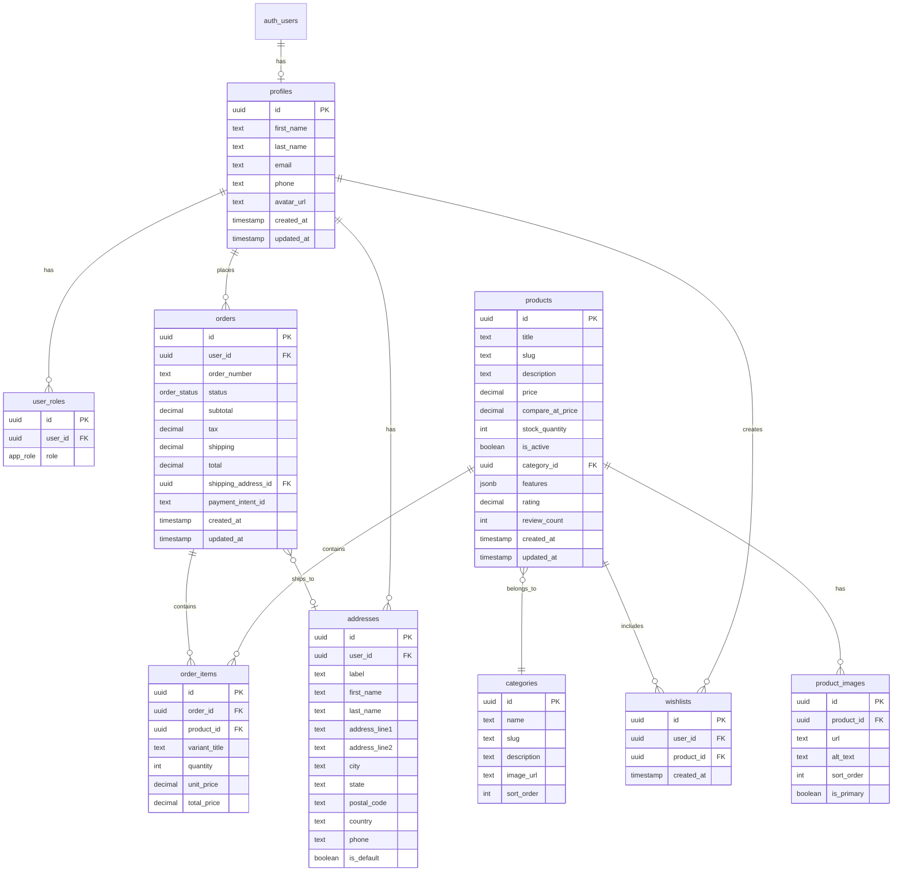
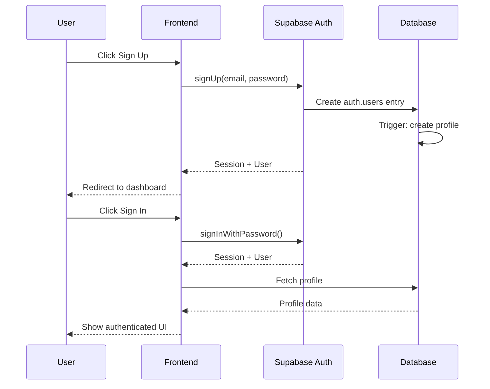
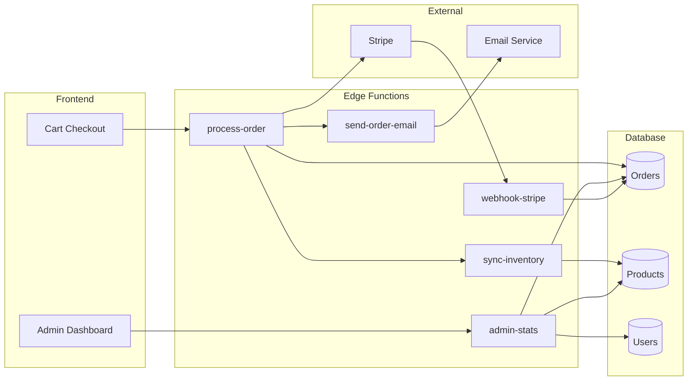
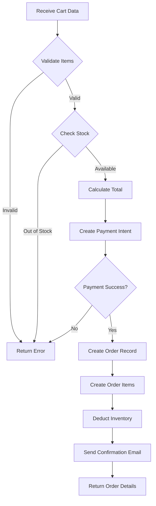
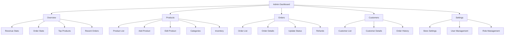
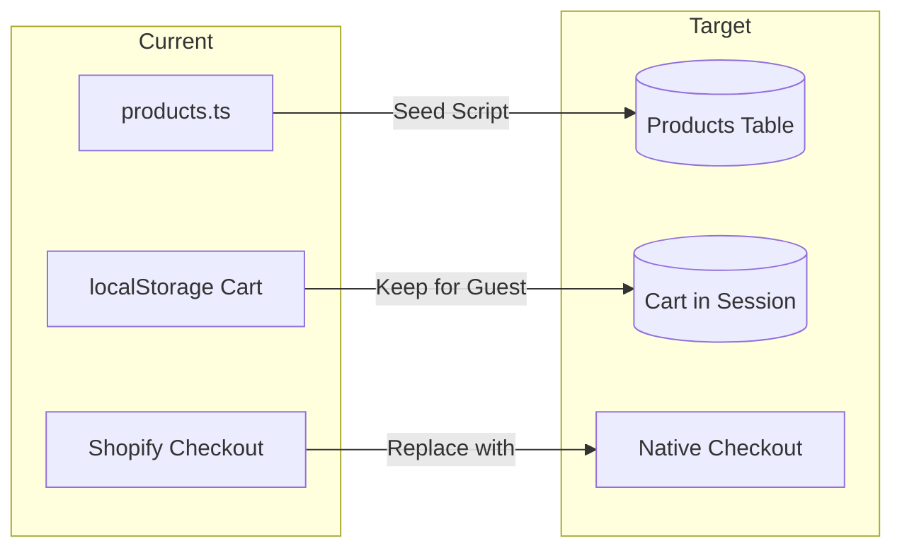
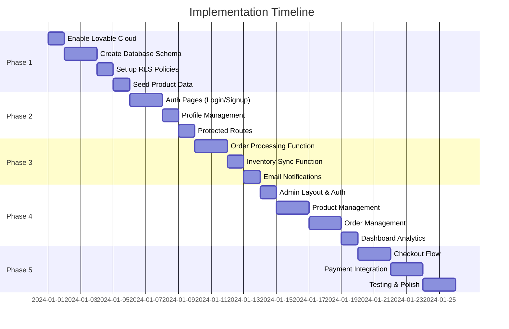

# Lovable Cloud Implementation Plan

## Overview

This document outlines the plan to migrate from a static frontend to a full-stack e-commerce application using Lovable Cloud.

---

## Phase 1: Database Schema

### Tables to Create



### Enums

```sql
-- User roles
CREATE TYPE public.app_role AS ENUM ('admin', 'moderator', 'user');

-- Order status
CREATE TYPE public.order_status AS ENUM (
  'pending',
  'confirmed',
  'processing',
  'shipped',
  'delivered',
  'cancelled',
  'refunded'
);
```

### Row Level Security (RLS) Policies

| Table | Policy | Description |
|-------|--------|-------------|
| profiles | Users can view/edit own profile | `auth.uid() = id` |
| user_roles | Admin only access | `has_role(auth.uid(), 'admin')` |
| products | Public read, admin write | Read: all, Write: admin only |
| orders | Users view own, admin view all | `user_id = auth.uid() OR has_role('admin')` |
| wishlists | Users manage own | `user_id = auth.uid()` |
| addresses | Users manage own | `user_id = auth.uid()` |

---

## Phase 2: Authentication

### Features to Implement

1. **Sign Up Flow**
   - Email/password registration
   - Email confirmation (optional)
   - Auto-create profile on signup via trigger

2. **Sign In Flow**
   - Email/password login
   - Session persistence
   - Redirect handling

3. **Password Recovery**
   - Forgot password email
   - Reset password page

4. **Profile Management**
   - View/edit profile
   - Manage addresses
   - Order history

### Auth Flow Diagram



---

## Phase 3: Edge Functions

### Functions to Create

| Function | Purpose | Trigger |
|----------|---------|---------|
| `process-order` | Validate cart, create order, handle payment | User checkout |
| `sync-inventory` | Update stock after order | Order confirmed |
| `send-order-email` | Confirmation emails | Order created |
| `admin-stats` | Dashboard analytics | Admin request |
| `webhook-stripe` | Handle Stripe events | Stripe webhook |

### Edge Function Architecture



### process-order Function Flow



---

## Phase 4: Admin Dashboard

### Pages & Features



### Admin Routes

| Route | Component | Access |
|-------|-----------|--------|
| `/admin` | AdminDashboard | admin |
| `/admin/products` | ProductList | admin |
| `/admin/products/new` | ProductForm | admin |
| `/admin/products/:id` | ProductForm | admin |
| `/admin/orders` | OrderList | admin |
| `/admin/orders/:id` | OrderDetail | admin |
| `/admin/customers` | CustomerList | admin |
| `/admin/settings` | Settings | admin |

---

## Phase 5: Migration from Shopify

### Data Migration



### Migration Steps

1. **Products**: Seed database from `products.ts`
2. **Cart**: Hybrid approach (localStorage for guests, DB for authenticated)
3. **Checkout**: Replace Shopify redirect with native flow

---

## Implementation Order



---

## Summary

| Phase | Deliverables | Effort |
|-------|--------------|--------|
| 1. Database | 8 tables, enums, RLS policies | 1-2 days |
| 2. Authentication | Login, signup, profile, password reset | 1-2 days |
| 3. Edge Functions | Order processing, inventory, emails | 2-3 days |
| 4. Admin Dashboard | Product/order management, analytics | 3-4 days |
| 5. Checkout | Native payment flow with Stripe | 2-3 days |

**Total Estimated Effort: 10-14 days**

---

## Next Steps

To begin implementation, confirm:

1. **Payment Provider**: Stripe recommended - do you have an account?
2. **Email Service**: Resend, SendGrid, or other preference?
3. **Priority**: Start with auth, or products first?
4. **Admin Access**: How should first admin be created?
