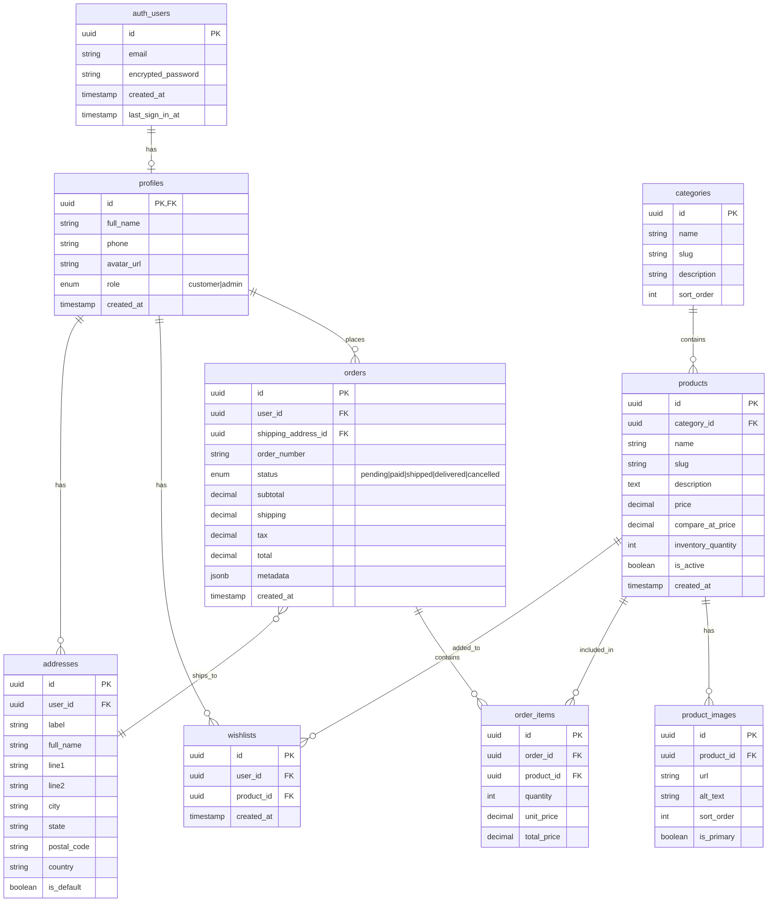
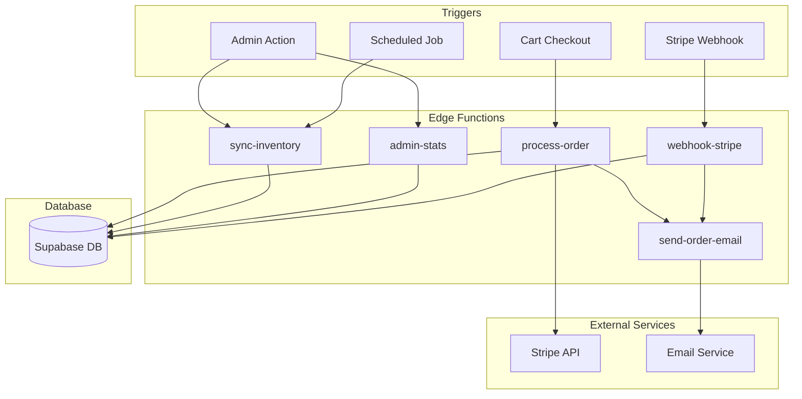
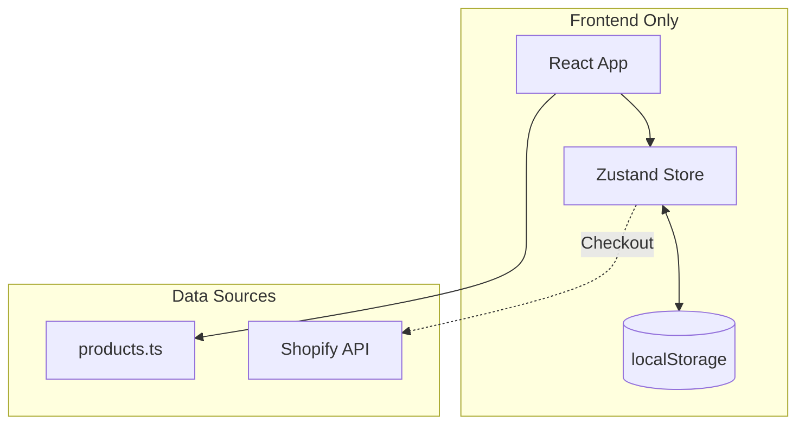

# Bulbul Database Schema & Edge Functions

## Current Status

**No Lovable Cloud database is currently configured.** This document shows the proposed schema for future implementation.

---

## Proposed Database Schema

---

## Proposed Edge Functions

---

## Edge Function Details

| Function | Trigger | Purpose | Dependencies |
|----------|---------|---------|--------------|
| `process-order` | Cart checkout | Creates order, initiates payment | Stripe API |
| `sync-inventory` | Admin/Cron | Updates product stock levels | Database |
| `send-order-email` | Order events | Sends confirmation/shipping emails | Email service |
| `admin-stats` | Admin dashboard | Aggregates analytics data | Database |
| `webhook-stripe` | Stripe events | Handles payment confirmations | Stripe webhooks |

---

## Current Architecture (No Cloud)

| Data | Current Storage | Future Storage |
|------|-----------------|----------------|
| Products | `src/data/products.ts` | Database `products` table |
| Cart | `localStorage` | Database or session |
| Orders | Shopify | Database `orders` table |
| Users | None | Supabase Auth + `profiles` |
| Wishlists | None | Database `wishlists` table |

---

## Implementation Reference

See [CLOUD_IMPLEMENTATION_PLAN.md](./CLOUD_IMPLEMENTATION_PLAN.md) for the full migration plan.
