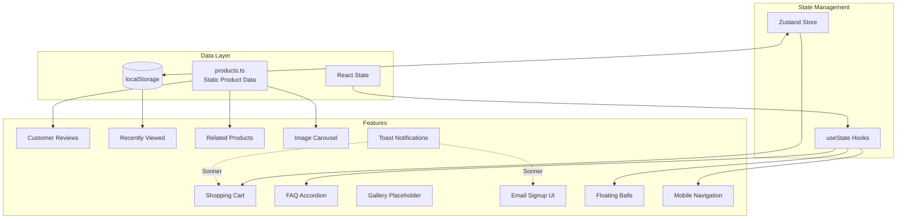
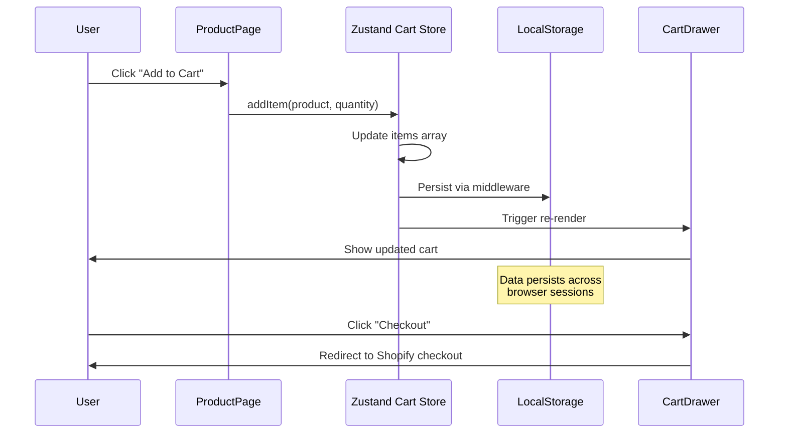

# Non-Shopify Features Architecture

## Overview

This document details website features that operate independently of Shopify, using local data storage, browser APIs, and React state management.

---

## Feature Architecture



---

## Client-Side Cart Flow



---

## Feature Details

| Feature | Data Source | Storage | Component(s) | Status |
|---------|-------------|---------|--------------|--------|
| Product Catalog | `products.ts` | Static file | `LocalProductCard`, `ProductDetail` | ✅ Complete |
| Shopping Cart | Zustand | `localStorage` | `CartDrawer`, `cartStore.ts` | ✅ Complete |
| Customer Reviews | `products.ts` | Static file | `CustomerReviews.tsx` | ✅ Static data |
| Recently Viewed | React state | `localStorage` | `ProductDetail.tsx` | ✅ Complete |
| Related Products | `products.ts` | Computed | `RelatedProducts.tsx` | ✅ Complete |
| FAQ | Static array | Component | `FAQ.tsx` | ✅ Complete |
| Email Signup | None | None | `ComingSoon.tsx` | ⚠️ UI only |
| Gallery | None | None | `Gallery.tsx` | ⚠️ Placeholder |
| Mobile Nav | React state | Memory | `Navbar.tsx` | ✅ Complete |
| Toasts | Sonner | Memory | Global | ✅ Complete |

---

## Implementation Notes

### Local Product Catalog
```typescript
// src/data/products.ts
export const products: LocalProduct[] = [...]
export const getProductByHandle = (handle: string) => {...}
export const getRelatedProducts = (handle: string, limit?: number) => {...}
```

### Cart Persistence
```typescript
// src/stores/cartStore.ts
export const useCartStore = create<CartState>()(
  persist(
    (set, get) => ({...}),
    { name: 'bulbul-cart' }
  )
)
```

### Recently Viewed
```typescript
// Stored in localStorage as JSON array
// Key: 'bulbul-recently-viewed'
// Max items: 8
```

---

## Features Requiring Backend

These features have UI but need Lovable Cloud for full functionality:

| Feature | Missing Component | Cloud Requirement |
|---------|------------------|-------------------|
| Email Signup | Email service integration | Edge function + email provider |
| Gallery | Image storage & management | Storage bucket + database |
| Reviews | Dynamic user reviews | Database + authentication |
| Wishlist | User wishlists | Database + authentication |
| Order History | Order tracking | Database + authentication |

---

## Related Documentation

- [Database Schema](./DATABASE_SCHEMA.md) - Proposed database structure
- [Cloud Implementation Plan](./CLOUD_IMPLEMENTATION_PLAN.md) - Migration roadmap
- [Architecture](./ARCHITECTURE.md) - Overall system architecture
